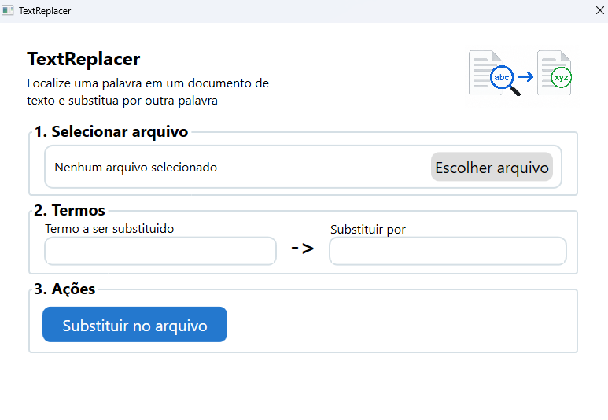
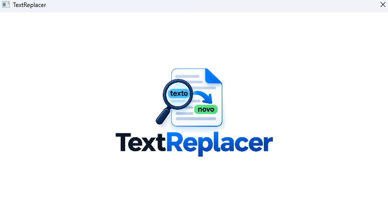

# TextReplacer

Aplicação desktop simples para substituição automatizada de termos em documentos.

Desenvolvida em **C#**, **WPF** e **.NET 10** durante meu estágio na **Prefeitura Municipal de Sales Oliveira**.

## 📌 Sobre o projeto

O **TextReplacer** é uma aplicação desenvolvida para automatizar uma tarefa repetitiva realizada durante o estágio.

A ferramenta permite que o usuário selecione um documento e realize automaticamente a substituição de termos específicos, evitando a necessidade de localizar e alterar cada ocorrência manualmente.

O projeto foi desenvolvido com foco em **simplicidade e objetividade**, possuindo apenas as funcionalidades necessárias para resolver o problema identificado.

Não utiliza banco de dados, sistema de login ou outras funcionalidades desnecessárias para sua finalidade.

> **Nota:** O projeto foi desenvolvido durante meu estágio na Prefeitura Municipal de Sales Oliveira, com autorização para utilização como parte do meu portfólio. O repositório não contém documentos, dados pessoais ou informações internas da Prefeitura.

## 🎯 Objetivo

Facilitar e agilizar a alteração de termos específicos em documentos, reduzindo o trabalho manual e tornando o processo menos suscetível a erros.

## ✨ Funcionalidades

- Seleção de documento;
- Localização de termos específicos;
- Substituição automática dos termos;
- Processamento do documento;
- Interface gráfica simples e direta;
- Publicação para Windows x64.

## 🖥️ Interface

### Tela principal


### Tela de inicialização


## 🖥️ Como funciona

O funcionamento da aplicação é simples:

```text
Selecionar documento
        ↓
Processar documento
        ↓
Localizar termos definidos
        ↓
Substituir termos
        ↓
Documento atualizado